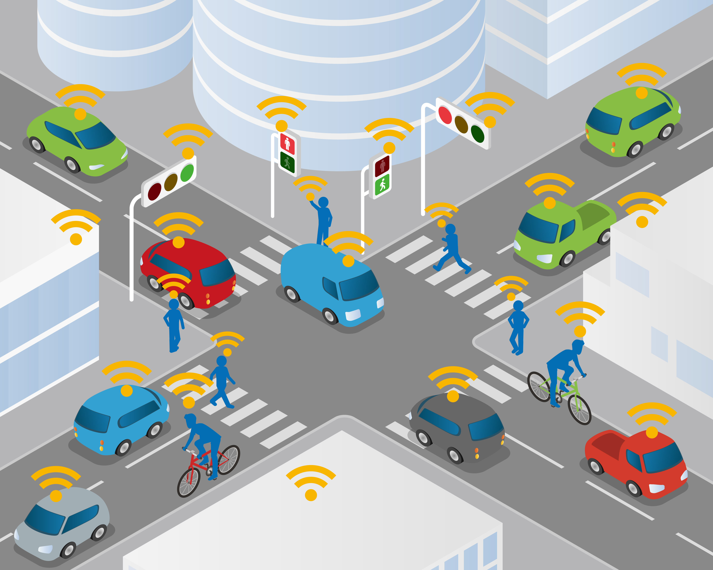

# Pedestrian Acknowledgement Smart System (PASS)



---
## Description
Our project is a 3-unit system that detects pedestrians in an intersection and relays a pedestrian status to nearby vehicles. PASS utilizes an ad hoc P2P network that notifies nearby and approaching vehicles of the presence of pedestrians. PASS can improve pedestrian safety and provide additional data for departments of transportation. PASS detects pedestrians and compiles pedestrian statistics with an RGBIR sensor and a microcontroller running a computer vision algorithm. Smartphones have directly endangered pedestrians in recentyears; the NHTSA estimates that 481,000 Americans use their phones while driving in daylight hours. PASS serves as an extra safeguard for pedestrians at traffic intersections. Pedestrian frequency information has potential utility for many future uses, such as tweaking traffic signal timing. System functions are distributed across a recognition unit, a broadcast unit, and a receiver.

---
## Setup

1. Rename your original interfaces file
```
sudo mv /etc/network/interfaces /etc/network/interfaces_original
```

2. Setup the ad hoc interface by typing the contents of the bitbucket interfaces file into
```
mv <unit name>/interfaces /etc/network/
```

5. Restart the pi

6. (For message SENDING) In a new super user terminal, type in 
ifup wlan0

7. (For message RECEIVING) In a new super user terminal, type in
ifdown wlan0

__WARNING__ - Manually editing your */etc/network/interfaces* file will prevent you from connecting to any internet. Copy your original *interfaces* file and keep it safe.

---

## Team Members

* **Zachary Rangel** - *Project Manager*
* **Ryan Thompson** - *Computer Vision and System Integration* - [rthomp10](https://github.com/rthomp10)
* **Mark Jones** - *Flag transmission optimization and analytics*

---

## License

This project is licensed under the MIT License - see the [LICENSE.md](LICENSE.md) file for details